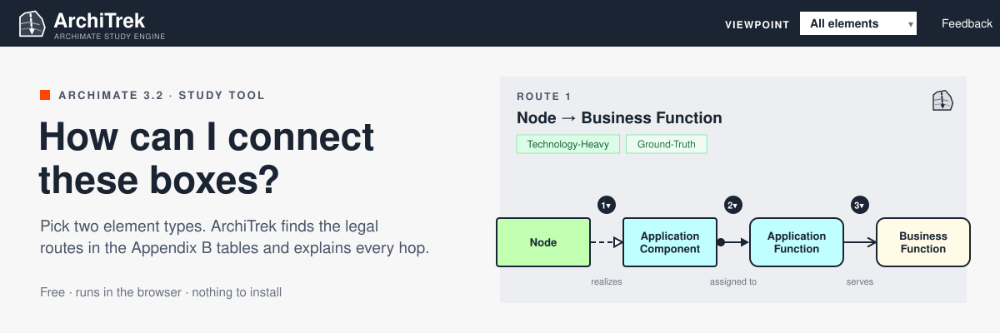
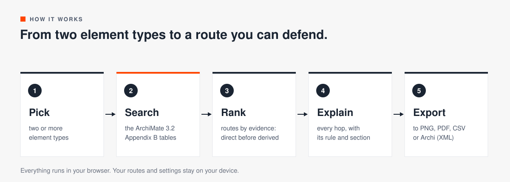

  <a href="https://architrek.hronmichal.net"><b>Open ArchiTrek</b></a>
  &nbsp;·&nbsp; <a href="docs/getting-started.md">Getting started</a>
  &nbsp;·&nbsp; <a href="docs/features.md">Features</a>
  &nbsp;·&nbsp; <a href="docs/teaching.md">For teachers</a>

ArchiTrek shows you how two ArchiMate element types can be connected, and why. Pick a start and an end, for example a Node and a Business Function. ArchiTrek searches the relationship tables in Appendix B of the ArchiMate 3.2 specification and returns the legal routes between them. It draws each route as a diagram and explains every hop: which relationship, whether the tables list it directly or only as a derivation, and which rule licenses it.

The relationship table tells you what is allowed. It does not tell you through what. ArchiTrek fills that gap. It runs in the browser, needs no account, and keeps your work in your browser.

## What you get

<table>
<tr><td width="50%" valign="top"><b>Pathfinding</b> Every legal route between two or more element types, ranked so that direct relationships come before shortcuts.</td><td width="50%" valign="top"><b>Hop by hop</b> Each hop explained in phases, with the relationship, the specification section and the rule behind it.</td></tr>
<tr><td width="50%" valign="top"><b>Evidence labels</b> Ground-Truth when the route reads as step-by-step structure. Simplified when it leans on derived shortcuts.</td><td width="50%" valign="top"><b>Semantic rigor</b> Academic, Pragmatic or Discovery. Choose how much the search may accept as an answer.</td></tr>
<tr><td width="50%" valign="top"><b>Waypoints</b> Pin an element in the middle. The search has to go through it.</td><td width="50%" valign="top"><b>Relationship type and flip</b> Right-click an arrow to pick its relationship or turn it around.</td></tr>
<tr><td width="50%" valign="top"><b>Viewpoints</b> Pick a standard viewpoint and the search drops elements that do not belong in it.</td><td width="50%" valign="top"><b>Spec excerpts</b> Every element on the route comes with its definition, aspect and section number.</td></tr>
<tr><td width="50%" valign="top"><b>Export</b> PNG, SVG, PDF, CSV, or Open Exchange XML that opens in Archi.</td><td width="50%" valign="top"><b>Share link</b> Every search is a link. Send the route instead of describing it.</td></tr>
<tr><td width="50%" valign="top"><b>Story themes</b> The same rules retold in a hospital, a university, a Formula One team or on the Death Star.</td><td width="50%" valign="top"><b>Report feedback</b> Found a link that is legal and still reads backward? Right-click it and report it.</td></tr>
</table>

The full list, with every menu and setting, is in [docs/features.md](docs/features.md).

## How it works

ArchiTrek treats the metamodel as a graph. Element types are the nodes. A relationship that Appendix B allows between two types is an edge. The search is a uniform-cost search, so it returns the cheapest routes first. Each hop has a cost that reflects how sure the specification is about it:

A route that leans on derived hops is still legal, and the results panel marks it as Simplified. [Reading the results](docs/reading-results.md) explains every badge and label.

## Start in two minutes

1. Open [architrek.hronmichal.net](https://architrek.hronmichal.net) on a laptop or desktop. The diagrams need the room, so phones get a reminder link.
2. Pick one of the examples in the welcome window, or choose your own start and end element.
3. Click Find Path, then click a route to read its explanation.

Or open a ready-made question:

| Question | Link |
|---|---|
| Can a Node reach a Business Function? | [Node → Business Function](https://architrek.hronmichal.net/?mode=ordered&path=2&wp0=Node&wp1=Business+Function) |
| The same, through the application layer | [Node → Application Component → Business Function](https://architrek.hronmichal.net/?mode=ordered&path=3&wp0=Node&wp1=Application+Component&wp2=Business+Function) |
| A pair that is legal and still reads backward | [Value Stream → Capability](https://architrek.hronmichal.net/?mode=ordered&path=2&wp0=Value+Stream&wp1=Capability) |

The step-by-step walk-through with screenshots is in [docs/getting-started.md](docs/getting-started.md).

## Documentation

Using ArchiTrek:

- [Getting started](docs/getting-started.md): your first route, step by step.
- [Features](docs/features.md): every control, menu and setting.
- [Reading the results](docs/reading-results.md): route groups, badges, the four kinds of link, semantic rigor, and what to do when no path is found.
- [Derivation rules](docs/derivation-rules.md): the twenty rules of Appendix B, each with an example from a car insurance case.
- [For teachers](docs/teaching.md): a classroom session plan, ready-made links and exercises.

Behind the scenes:

- [Relationship data](docs/relationship-data.md): where the tables come from, how direct, derived and potential are decided, and how to regenerate them.
- [Running and hosting](docs/self-hosting.md): run locally, deploy, configure analytics and feedback.
- [Roadmap](docs/ROADMAP.md): what comes next, starting with expanding and contracting derived arrows on the diagram.

## Credits

The relationship tables and derivation rules come from The Open Group's ArchiMate® 3.2 Specification, Appendix B (© 2012–2023 The Open Group). The machine-readable encoding and the SPARQL derivation rules are by Alberto D. Mendoza in [archimate_ontology](https://github.com/AlbertoDMendoza/archimate_ontology) (Apache-2.0). PDF export uses [jsPDF](https://github.com/parallax/jsPDF) and [svg2pdf.js](https://github.com/yWorks/svg2pdf.js).

ArchiTrek is an unofficial study tool. ArchiMate is a registered trademark of The Open Group. ArchiTrek is not affiliated with or endorsed by The Open Group.

Made by [Michal Hron](https://www.hronmichal.net). Found a bug or a relationship that looks wrong? Use Feedback in the app, or open an issue here.

## License

No license file yet. Add a `LICENSE` file before you reuse the code under explicit terms.
