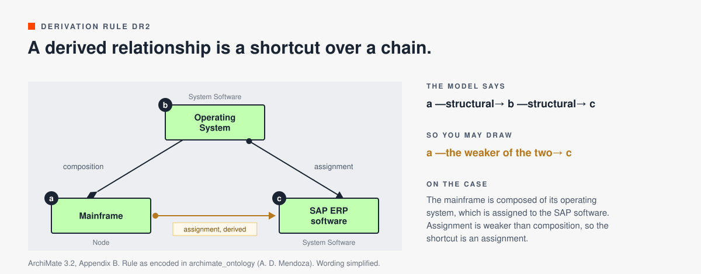

# Derivation rules

A derived relationship is a shortcut over a chain of other relationships. The relationship tables in Appendix B list which shortcuts are allowed. The rules in Appendix B.2 and B.3 say how a chain produces one. ArchiTrek uses these rules to sort every derived code into valid or potential (see [relationship-data.md](relationship-data.md)), and the hop explanation names the kind for each hop.

## Valid and potential

There are twenty rules.

- DR1 to DR8 (Appendix B.2) produce valid derivations. If the chain holds, you may draw the shortcut.
- PDR1 to PDR12 (Appendix B.3) produce potential derivations. The specification says such a result "might be relevant but may also be wrong". Check it against the case before you draw it.

The pattern across the rules: a relationship that travels up the structure, or along a chain of triggers, is valid. A relationship pushed across a kind-of, from a whole down to one of its parts, or through a middle element that may not pass it on, is only potential.

Some terms the rules use:

- Structural relationships are composition, aggregation, assignment and realization, from strongest to weakest.
- Dependency relationships are serving, access, influence and association.
- Dynamic relationships are triggering and flow.

In the rules, `p(a,b):S` means a relationship p of type S from a to b. The examples use a car insurance company with a finance department, an SAP ERP system and a mainframe.

## The six families

| Family | What the chain combines | Valid | Potential |
|---|---|---|---|
| [Kind of](#1-kind-of) | Specialization with another relationship | DR1 | PDR1, PDR2, PDR3, PDR4 |
| [Structure, then structure](#2-structure-then-structure) | Two structural relationships in a row | DR2 | none |
| [Structure and dependency](#3-structure-and-dependency) | Structure next to serving, access, influence or association | DR3, DR4 | PDR5, PDR6 |
| [Structure and dynamics](#4-structure-and-dynamics) | A structural relationship next to triggering or flow | DR5, DR6, DR7 | PDR8, PDR9, PDR11 |
| [Chains of the same kind](#5-chains-of-the-same-kind) | Triggering, flow or dependency, twice in a row | DR8 | PDR7, PDR10 |
| [Groupings](#6-groupings) | A grouping and its members | none | PDR12 |

## 1. Kind of

A specialization chain is safe. Pushing other relationships across a kind-of is a guess.

### DR1: specialization chained

Valid. If two relationships p(a,b):S and q(b,c):S exist, with S being specialization, then r(a,c):S can be derived.
A senior claims handler (a) is a kind of claims handler (b), and a claims handler is a kind of insurance employee (c). So a senior claims handler is a kind of insurance employee. Kind-of chains hold all the way up.

### PDR1: specialization then a relationship

Potential. If specialization p(a,b):S and relationship q(b,c):T exist, potentially derive r(a,c):T.
The Car Insurance Service (a) is a kind of Insurance Service (b), and the Insurance Service serves the Customer (c). So the Car Insurance Service may serve the Customer. Check it: the general service may serve customers the car variant never sees.

### PDR2: specialization, inbound to the general

Potential. If specialization p(a,b):S and relationship q(c,b):T exist, potentially derive r(c,a):T.
The Claims Handler (c) is assigned to Handle Claim (b), and Handle Car Claim (a) is a kind of Handle Claim. So the Claims Handler may be assigned to Handle Car Claim. Check it: car claims may go to a specialist.

### PDR3: specialization, outbound from the specific

Potential. If specialization p(a,b):S and relationship q(a,c):T exist, potentially derive r(b,c):T.
Handle Car Claim (a) reads the Vehicle Damage Report (c), and Handle Car Claim is a kind of Handle Claim (b). So Handle Claim may read the Vehicle Damage Report. Check it: a travel or home claim has no vehicle.

### PDR4: specialization, inbound to the specific

Potential. If specialization p(a,b):S and relationship q(c,a):T exist, potentially derive r(c,b):T.
The Car Damage Expert (c) is assigned to Handle Car Claim (a), a kind of Handle Claim (b). So the Car Damage Expert may be assigned to Handle Claim. Check it: the expert does not handle home or travel claims.

## 2. Structure, then structure

### DR2: two structural relationships

Valid. If two structural relationships p(a,b):S and q(b,c):T exist, derive r(a,c):U with U being the weakest of S and T.
The mainframe (a) is composed of the mainframe operating system (b), which is assigned to the SAP ERP software (c). Assignment is weaker than composition, so the shortcut is an assignment. Strongest first: composition, aggregation, assignment, realization.

## 3. Structure and dependency

### DR3: structural then dependency

Valid. If structural p(a,b):S and dependency q(b,c):T exist, derive r(a,c):T.
Bookkeeping (a) realizes the Bookkeeping Service (b), which serves Financial Transaction Processing (c). So Bookkeeping serves Financial Transaction Processing.

### DR4: structural plus dependency into the target

Valid. If structural p(a,b):S and dependency q(c,b):T exist, derive r(c,a):T.
The Finance Department (a) is assigned to Financial Transaction Processing (b), and the Bookkeeping Service (c) serves that process. So the Bookkeeping Service serves the Finance Department. Serving the work means serving whoever does it.

### PDR5: structural, dependency into the source

Potential. If structural p(a,b):S and dependency q(c,a):T exist, potentially derive r(c,b):T.
The Hosting Service (c) serves the SAP ERP system (a), which is composed of Financial Accounting (b). So the Hosting Service may serve Financial Accounting. Check it: a module can run somewhere else than the system around it.

### PDR6: structural, dependency from the source

Potential. If structural p(a,b):S and dependency q(a,c):T exist, potentially derive r(b,c):T.
The SAP ERP system (a) serves the Finance Department (c) and is composed of an HR module (b). So the HR module may serve the Finance Department. Check it: Finance uses the accounting modules, and the HR module serves other departments.

## 4. Structure and dynamics

### DR5: structural then dynamic

Valid. If structural p(a,b):S and dynamic q(b,c):T exist, derive r(a,c):T.
The Finance Department (a) is assigned to Financial Transaction Processing (b), which passes its results to Financial Reporting (c). So the Finance Department has a flow to Financial Reporting.

### DR6: structural plus flow into the target

Valid. If structural p(a,b):S and flow q(c,b):T exist, derive r(c,a):T.
The Finance Department (a) is assigned to Financial Transaction Processing (b). Handle Claim (c) sends payment data into that process. So Handle Claim has a flow to the Finance Department. What flows into the work flows to whoever does it.

### DR7: triggering then structural

Valid. If triggering p(a,b):S and structural q(b,c):T exist, derive r(a,c):S.
Assess Claim (a) triggers Pay Claim (b), and Pay Claim is composed of Transfer Money (c). So Assess Claim triggers Transfer Money. Triggering a process sets what it is made of in motion.

### PDR8: flow then structural

Potential. If flow p(a,b):S and structural q(b,c):T exist, potentially derive r(a,c):S.
Handle Claim (a) sends data to Financial Transaction Processing (b), which is composed of Archive Receipts (c). So Handle Claim may have a flow to Archive Receipts. Check it: the claim data goes to booking the payment, and the archive may never see it.

### PDR9: structural, dynamic from the source

Potential. If structural p(a,b):S and dynamic q(a,c):T exist, potentially derive r(b,c):T.
Financial Transaction Processing (a) is composed of Book Payment (b), and it triggers Monthly Close (c). So Book Payment may trigger Monthly Close. Check it: only the last step of the process may trigger the close.

### PDR11: triggering, structural into the target

Potential. If triggering p(a,b):S and structural q(c,b):T exist, potentially derive r(a,c):S.
Take Customer Call (a) triggers Assess Claim (b), which is part of Handle Claim (c). So Take Customer Call may trigger Handle Claim. Check it: triggering one step in the middle does not start the whole process.

## 5. Chains of the same kind

### DR8: triggering chained

Valid. If triggering p(a,b):S and triggering q(b,c):S exist, derive r(a,c):S.
Register Claim (a) triggers Assess Claim (b), which triggers Pay Claim (c). So Register Claim triggers Pay Claim. Read the shortcut as "eventually leads to".

### PDR7: two dependencies

Potential. If dependencies p(a,b):S and q(b,c):T exist, potentially derive r(a,c):U with U being the weakest.
The Hosting Service (a) serves Bookkeeping (b), which serves Financial Transaction Processing (c). So the Hosting Service may serve Financial Transaction Processing. Compare DR3: structure then serving is valid. Serving then serving is only potential.

### PDR10: flow chained

Potential. If flow p(a,b):S and flow q(b,c):S exist, potentially derive r(a,c):S.
Register Claim (a) passes data to Assess Claim (b), which passes data to Pay Claim (c). So Register Claim may have a flow to Pay Claim. It holds only if the same data travels the whole way.

## 6. Groupings

### PDR12: through a grouping

Potential. If aggregation or composition p(b,a):S and realization or assignment q(b,c):T exist, with b being a Grouping, potentially derive r(a,c):T.
The Finance Systems grouping (b) aggregates the SAP ERP system (a) and realizes the Bookkeeping Service (c). So the SAP ERP system may realize the Bookkeeping Service. Check it: another member of the group may be the one that realizes it.

## Sources

ArchiMate 3.2 Specification, Appendix B. Rule wording follows the [archimate_ontology](https://github.com/AlbertoDMendoza/archimate_ontology) project by A. D. Mendoza, simplified here. The examples come from a car insurance teaching case.
