# Features

Every control in ArchiTrek, in the order you meet it on screen. For a guided first route, start with [getting-started.md](getting-started.md).

<table>
<tr><td width="96" valign="top">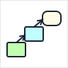</td><td valign="top"><a href="#finding-a-path">Finding a path</a><br><a href="#waypoints">Waypoints</a><br><a href="#search-options">Search options</a></td>
<td width="96" valign="top">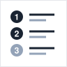</td><td valign="top"><a href="#the-results">The results</a><br><a href="#the-explanation">The explanation</a><br><a href="#the-metamodel-view">The metamodel view</a></td></tr>
<tr><td width="96" valign="top">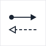</td><td valign="top"><a href="#the-diagram">The diagram</a><br><a href="#right-click-a-hop">Right-click a hop</a><br><a href="#diagram-display-options">Display options</a></td>
<td width="96" valign="top">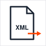</td><td valign="top"><a href="#download-and-share">Download and share</a><br><a href="#viewpoints">Viewpoints</a><br><a href="#story-themes">Story themes</a><br><a href="#feedback">Feedback</a></td></tr>
</table>

## The header

The dark bar at the top holds the controls you use most:

| Control | What it does |
|---|---|
| Edit path | Opens and closes the waypoint editor. |
| ‹ › | Undo and redo. Ctrl+Z undoes, Ctrl+Y or Ctrl+Shift+Z redoes. |
| Viewpoint | Restricts the search to one ArchiMate viewpoint. See [Viewpoints](#viewpoints). |
| Theme | Retells the explanations in a different story. See [Story themes](#story-themes). |
| ? | Help: how the search works, what the labels mean, and where Appendix B shows up. |
| Feedback | Sends a message, with a summary of your current settings attached. |

## Finding a path


Pick two or more element types and click Find Path. ArchiTrek treats the metamodel as a graph and runs a uniform-cost search over it. Each hop has a cost based on how sure the specification is about it, so the routes come back cheapest first. [reading-results.md](reading-results.md#the-four-kinds-of-link) lists the costs.

There are two modes:

- Ordered: you set Start → Via → End, and the route follows that order. This is the default.
- Connect set: order does not matter. ArchiTrek reorders your points to find the strongest legal chain that connects them all.

The first visit opens a welcome window with four examples. Show quick examples in the editor brings them back.

## Waypoints

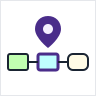

Each waypoint is a card in the editor. A is the start, the last card is the end, and the cards between are via points. The route must pass through every via point.

<p align="center">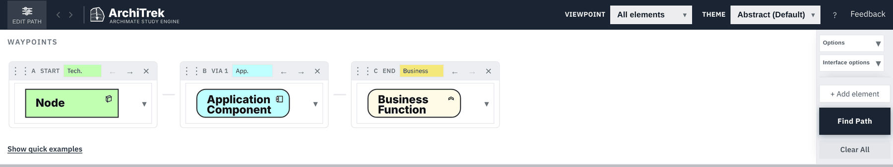</p>

- Click an element to choose a different type. Elements outside the current viewpoint are greyed out.
- The coloured tag shows the element's layer.
- Drag the handle on the left of a card, or use its arrows, to reorder. × removes it.
- + Add element adds a via point. Clear All empties the editor.

Use a via point to force the route through the layer you actually mean. If Node to Business Function skips the application layer, pin an Application Component in the middle.

## Search options


Click Options next to the waypoints.

<p align="center">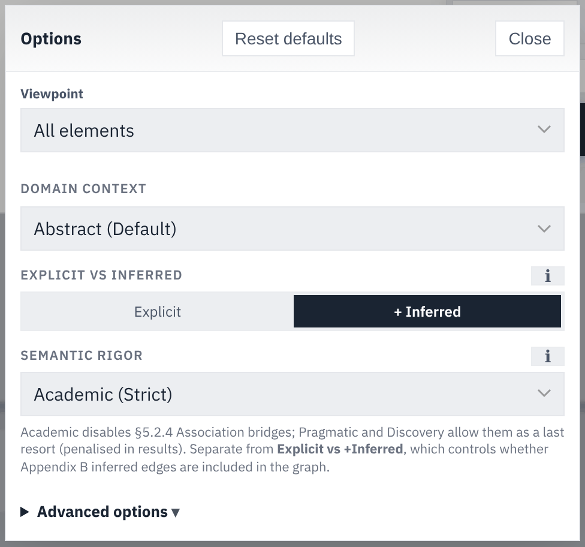</p>

| Option | Choices | What it changes |
|---|---|---|
| Viewpoint | All elements, or one of 24 viewpoints | Which element types the search may use. |
| Domain context | The story themes | The wording of explanations. The rules stay the same. |
| Explicit vs Inferred | Explicit, + Inferred | Whether derived relationships exist in the graph at all. |
| Semantic rigor | Academic (Strict), Pragmatic (Balanced), Discovery (Loose), Custom | How strictly routes are judged, and whether association may bridge a gap. |

[reading-results.md](reading-results.md#semantic-rigor) explains the three rigor presets and their gates.

### Advanced options


Advanced options open the search engine itself. Each one has a ? that explains it.

| Setting | What it does |
|---|---|
| Ordered or Connect set | The path mode described above. |
| Max hops per segment | The longest chain allowed between two consecutive waypoints. |
| Alternatives per segment | How many different routes to keep per segment. |
| Search effort | Fast, Balanced or Thorough. How much of the graph to explore before giving up. |
| Perspective grouping | Exclusive layers, or Dominant layer share with a threshold from 50% to 90%. How routes are sorted into the three groups. |
| Advanced Logic Overrides | Allow Association Fallback (§5.2.4). Restrict Core→Core detours via Motivation/Strategy. Enforce dependency grammar (anti V-shape). Treat Realization as directional in grammar. Changing these sets Semantic rigor to Custom. |
| Hop costs | Explicit, Inferred (B.2), Potential (B.3), Association, Layer-skip penalty and Violation penalty. |
| Cognitive load penalty | Makes long routes more expensive. After a grace period of hops (default 3), each hop's cost grows by a growth factor (default 2.5). |

A reset button returns the costs to their defaults.

## The results


The results panel lists the routes in three groups: Business Operations, System Infrastructure and Strategic Realization. Each route shows its number of hops and two badges: a layer badge (Business-Heavy, Technology-Heavy, Full-Stack Alignment) and an evidence badge (Ground-Truth or Simplified). Click a route to draw it.

When a group is empty, the panel explains why and suggests elements to add. A note under the list reads the set as a whole and offers one-click changes.

[reading-results.md](reading-results.md) explains every group and badge.

## The explanation


The panel next to the route list explains the selected route:

- The title, badges, number of hops, main relationship type and number of inferred hops.
- How this path reads: the route in plain language, with its number of layer crossings.
- Spec excerpts for elements on this path: each element's definition, aspect (active structure, behavior, passive structure and so on) and section number.
- Step-by-step justification: the route in phases, one per layer crossing. Each hop shows the relationship and its code, both elements, and the codes allowed in the opposite direction. A hop that is still undecided shows Relationship Pending.

<p align="center"></p>

## The metamodel view


Each step in the explanation has a Show on metamodel link. It opens the generic metamodel diagram from the specification and lights up the part that licenses that hop. Use it to connect a route back to the figures in chapters 3 to 12.

## The diagram

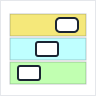

The diagram draws the selected route in ArchiMate notation and layer colours. Drag to pan, and scroll or pinch to zoom.

| Toolbar control | What it does |
|---|---|
| Swimlanes | Draws layer bands behind the route, with connectors that cross between them. |
| − + ↺ | Zoom out, zoom in, reset pan and zoom. |
| Gear | Display options, below. |
| Share icon | Download and share, below. |
| Full screen | Gives the diagram the whole screen. |

Each hop carries a numbered badge. A hop that allows several relationship types is drawn as a dashed grey line labelled Undecided until you pick one.

<p align="center">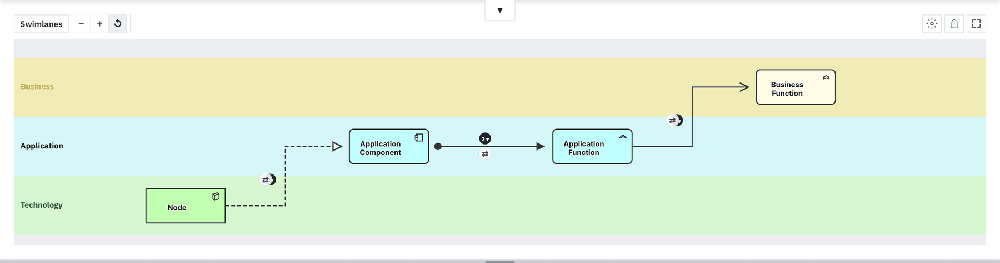</p>

### Right-click a hop

Right-click the label in the middle of an arrow, or Ctrl-click it.

<p align="center"></p>

| Menu item | What it does |
|---|---|
| Relationship type | Pick one of the relationship types the tables allow on this hop. |
| Flip direction | Turn the hop around, when the reverse direction is also allowed. |
| Pin current direction | Keep this direction when you search again. Unpin forced direction undoes it. |
| Report feedback | Report this relationship. See [Feedback](#feedback). |

A ⇄ marker under a hop means its direction can be flipped.

### Diagram display options

Click the gear above the diagram.

| Group | Choices |
|---|---|
| Path layout | Horizontal (left to right), Vertical (top to bottom through the layers), Compact (layer-aligned with 90° connectors). |
| Arrow overlays | Hop numbers, Flip direction controls, Relationship names on arrows, Locked direction markers. |

Interface options, next to Options in the editor, switch between horizontal and vertical panels, move the controls to the left or the top, and put the route list and explanation under or beside the diagram. It also turns the illustrated composite sub-components on or off.

## Download and share


Click the share icon above the diagram.

<p align="center">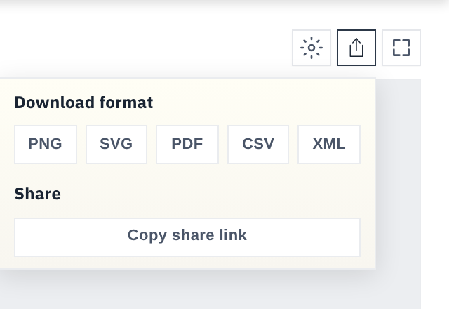</p>

| Format | What you get |
|---|---|
| PNG | An image of the diagram. |
| SVG | A vector image you can edit. |
| PDF | A printable page. |
| CSV | The hops as a table. |
| XML | An Open Exchange model. In Archi, use File, Import, Open Exchange XML Model. |
| Copy share link | A URL that opens this diagram with its viewpoint, waypoints and selected route. |

Share links use URL parameters, so you can also write them by hand:

```
https://architrek.hronmichal.net/?mode=ordered&path=3&wp0=Node&wp1=Application+Component&wp2=Business+Function
```

`path` is the number of waypoints, and `wp0`, `wp1` and so on name them in order, with `+` for spaces.

## Viewpoints

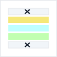

The Viewpoint menu holds the example viewpoints of Appendix C of the specification. Picking one greys out the element types that do not belong to it and keeps them out of the search. For example, Technology Usage has no Business Function, so a route to a Business Function cannot use it.

| Group | Viewpoints |
|---|---|
| Composition | Organization, Application Structure, Information Structure, Technology, Layered |
| Support | Product, Application Usage, Technology Usage |
| Cooperation | Business Process Cooperation, Application Cooperation |
| Realization | Service Realization, Implementation and Deployment |
| Motivation | Stakeholder, Goal Realization, Requirements Realization, Motivation |
| Strategy | Strategy, Capability Map, Value Stream, Outcome Realization, Resource Map |
| Implementation and Migration | Project, Migration, Implementation and Migration |

All elements turns the filter off. Layered allows the full metamodel.

## Story themes

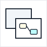

The Theme menu retells the explanations and the route group titles in a different setting. The search rules do not change.

Themes: Abstract (the default), Bored, Circus, Death Star, Formula One, Hospital, Rebel Alliance and University. Some themes have a shuffle button that picks a different story cluster.

## Feedback


There are two ways to send feedback.

Report feedback, from the right-click menu on a hop, reports one relationship. Pick a category and write a justification:

- Logical Mismatch: the rules allow it and it still reads backward. Value Stream serving Capability is one example.
- Metamodel Conflict: you are sure a link should be allowed and the tool will not give it to you.

The justification is required, so a report is an argument. Submitted reports go to a public review sheet.

Feedback, in the header, sends a general message by email with a summary of your settings.

## On a phone

The diagrams need room, so on a small screen ArchiTrek shows a short explanation instead of the app. You can send yourself a reminder email to open it later on a laptop.

## Privacy

ArchiTrek stores your settings and last session in your browser, so it can restore them. Your routes and settings stay there unless you send feedback. The hosted site counts visits with Google Analytics, configured in `config/analytics-config.js`.
