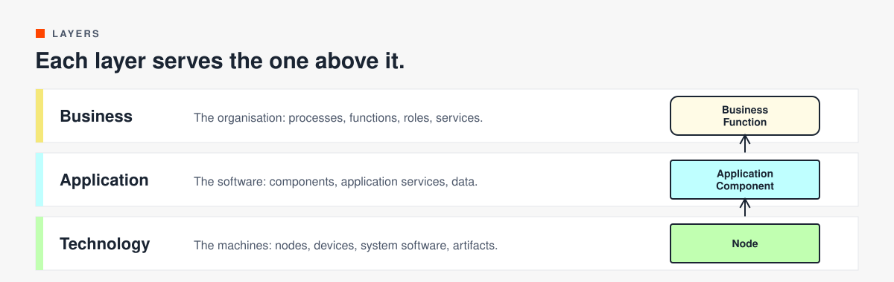
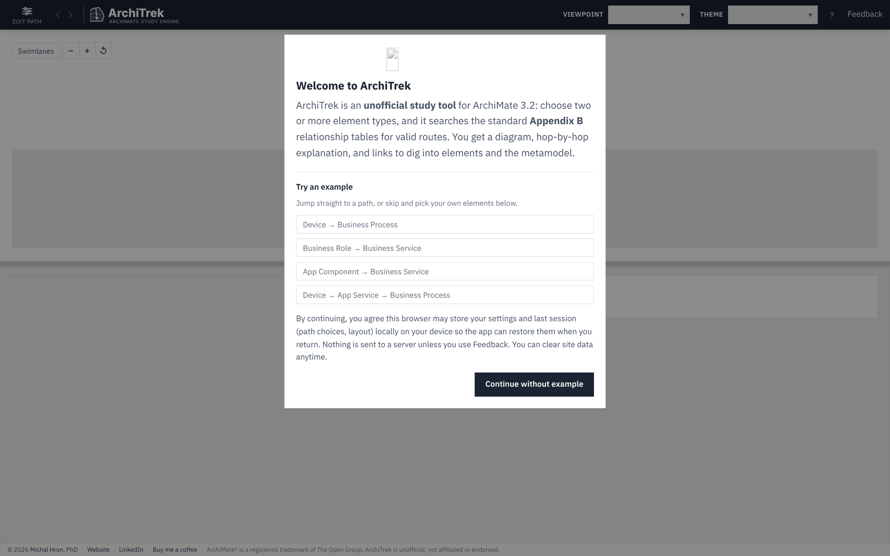

# Getting started

This walk-through finds a route from a Node to a Business Function through an Application Component. It takes about five minutes. Open [architrek.hronmichal.net](https://architrek.hronmichal.net) on a laptop or desktop and follow along.

## 1. Start from the welcome window

The first time you open ArchiTrek, a welcome window offers four examples:

- Device → Business Process
- Business Role → Business Service
- App Component → Business Service
- Device → App Service → Business Process

Click one to jump straight to a path, or click Continue without example to pick your own elements.

ArchiTrek keeps your settings and last session in your browser, so it can restore them when you come back.

## 2. Choose the elements

Click Edit path in the top-left corner to open the waypoint editor. Each card is one waypoint. A is the start, the last letter is the end, and anything between is a via point.

- Click the element in a card to pick a different element type. The coloured tag shows its layer.
- Click + Add element to add a via point. The route then has to pass through it.
- Use the arrows on a card to move it earlier or later, and × to remove it.
- Clear All empties the editor. Show quick examples brings back the example paths.

For this walk-through, pick Node as A, Application Component as B and Business Function as C. Or open [this link](https://architrek.hronmichal.net/?mode=ordered&path=3&wp0=Node&wp1=Application+Component&wp2=Business+Function), which sets all three.

## 3. Check the options

Click Options on the right of the editor. For coursework, keep the defaults:

- Explicit vs Inferred: + Inferred.
- Semantic rigor: Academic (Strict).

[reading-results.md](reading-results.md#explicit-and--inferred) explains what each setting changes.

## 4. Find the path

Click Find Path. The editor closes, the diagram shows Route 1, and the results panel lists the alternatives.

Click any route in the list to draw it. The badges tell you where the route sits (Technology-Heavy, Business-Heavy, Full-Stack Alignment) and how much it relies on shortcuts (Ground-Truth or Simplified). [reading-results.md](reading-results.md) explains each one.

## 5. Decide each hop

Many hops allow more than one relationship type. ArchiTrek draws those as a dashed grey line labelled Undecided. It leaves the choice to you.

Right-click the label on a hop. Open Relationship type and pick the one that matches your case. For this route:

1. Node realizes Application Component.
2. Application Component is assigned to Application Function.
3. Application Function serves Business Function.

The same menu flips the direction of a hop and lets you report a relationship that looks wrong. On a Mac, Ctrl-click works too.

## 6. Read the explanation

Scroll the panel on the right. How this path reads gives the route in plain language. Spec excerpts lists the definition of every element on the route. Step-by-step justification walks through each hop, phase by phase, with the relationship code and the specification section.

Read this before you draw the route in your own model. A derived hop is only true if the chain underneath it is.

## 7. Change the view

The toolbar above the diagram has:

- Swimlanes, which draws the route across layer bands.
- −, + and ↺ to zoom out, zoom in and reset.
- The gear for display options, the share icon for download and share, and full screen.

## 8. Take it with you

Click the share icon above the diagram.

- PNG, SVG and PDF give you the picture.
- CSV gives you the hops as a table.
- XML is Open Exchange format. Import it in Archi with File, Import, Open Exchange XML Model.
- Copy share link copies a URL that opens this exact route, with its viewpoint and waypoints.

## Next

- [Features](features.md) lists every control in the app.
- [Reading the results](reading-results.md) explains the badges and the four kinds of link.
- [Derivation rules](derivation-rules.md) explains why a derived hop is allowed.
