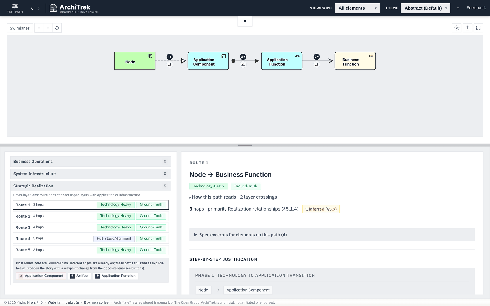
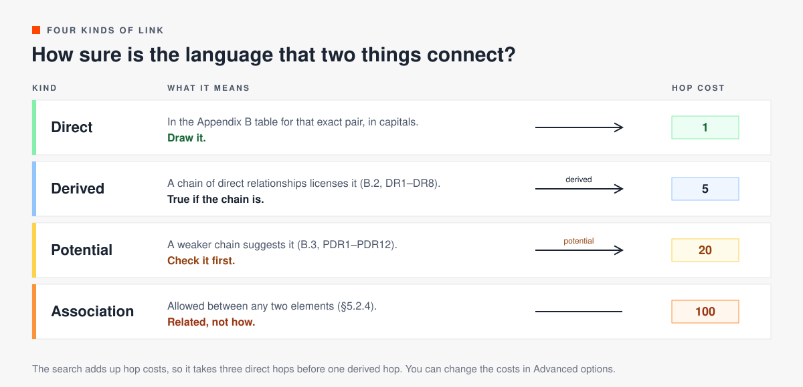
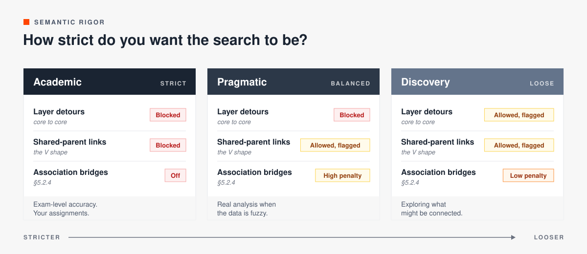
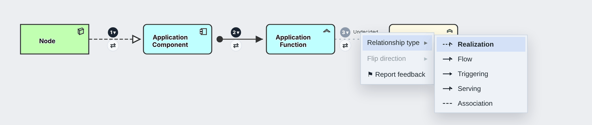
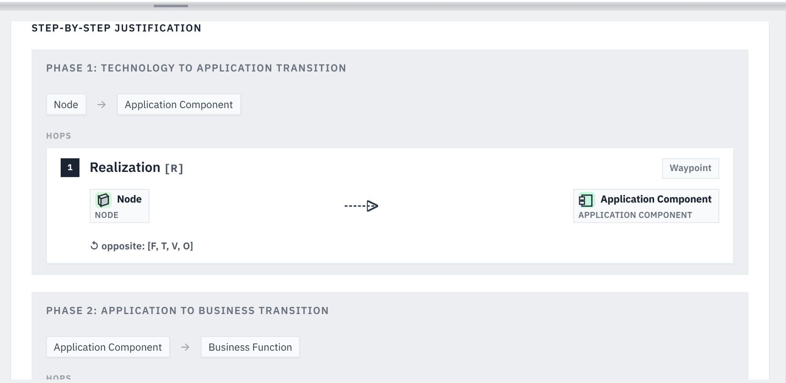

# Reading the results

After Find Path, the screen has three parts. The diagram at the top draws the selected route. The results panel at the bottom left lists the routes in three groups. The explanation at the bottom right walks through the selected route hop by hop.

## The route list

Routes come back cheapest first. The search adds up a cost for every hop, so Route 1 is the route with the strongest evidence for the fewest steps. The routes after it are legal too. A long list does not mean the first one is the right one for your model.

Routes are sorted into three groups, called lenses:

| Group | What the hops stay in |
|---|---|
| Business Operations | Motivation, Strategy and Business. The upper layers only. |
| System Infrastructure | Application, Technology and Implementation. |
| Strategic Realization | Both. The route connects the upper layers with the application or technology layers. |

The number next to each group counts its routes. When a group is empty, the panel says why and suggests an element to add. Story themes rename the groups to fit the story, so the hospital theme uses its own titles.

Under the list, a short note reads the whole set. It might say that most routes are Ground-Truth, and offer buttons that add or remove an element to broaden the story from the opposite lens.

## Badges on a route

Each route carries two badges.

### Layer badge

The layer badge says where most of the route's elements sit.

| Badge | Meaning |
|---|---|
| Business-Heavy | Most elements are in Motivation, Strategy or Business. |
| Technology-Heavy | Most elements are in Application or Technology. |
| Full-Stack Alignment | The route has elements both in the upper layers and in technology. |
| Implementation-Heavy | Most elements are in Implementation and Migration. |

### Ground-Truth and Simplified

The second badge says how much the route relies on derived shortcuts.

- Ground-Truth: the route reads as step-by-step structure. Use it when you need the exact mechanics of how a system is wired.
- Simplified: the route hides some of the plumbing behind derived relationships. Use it for a high-level summary, for example for business stakeholders.

The exact rule is a simplification score from 0 to 100, computed in `logic/pathfinder.js`. A route with only direct hops scores 0. A route with derived hops scores up to 70 for how much routing cost it compresses, plus 30 if it passes through Motivation or Strategy elements. An Association hop subtracts 50. At 60 or more the route is Simplified. So a route with one cheap derived hop can still be Ground-Truth.

## The four kinds of link

Every hop on a route is one of four kinds. The kind sets the hop's cost in the search.

| Kind | Where it comes from | Default cost |
|---|---|---|
| Direct | An uppercase code in the Appendix B table for that exact pair. Drawn in the chapter 3–12 metamodel figures. | 1 |
| Derived | A lowercase code that rules DR1–DR8 (Appendix B.2) produce. True if the chain behind it is true. | 5 |
| Potential | A lowercase code that only the potential rules PDR1–PDR12 (Appendix B.3) produce. Check it before you draw it. | 20 |
| Association | §5.2.4 allows association between any two elements. It says two things are related, but not how. | 100 |

The explanation shows derived and potential hops as inferred (§5.7). [derivation-rules.md](derivation-rules.md) explains every rule with an example.

The costs are defaults. You can change them in Options, under Advanced options. A higher cost means "avoid this hop unless it is worth it".

## Explicit and + Inferred

The first switch in Options decides which edges exist in the graph at all.

- Explicit: only uppercase, direct relationships. This is the strictest graph.
- + Inferred: direct relationships plus the Appendix B derivations. This is the default.

## Semantic rigor

Semantic rigor is a separate control. It does not change which edges exist. It judges routes on top of the graph, with three gates.

| Gate | What it stops |
|---|---|
| Layer detours (core to core) | Linking two technology elements by a shortcut through the Motivation layer, for example two servers that share a goal. |
| Shared-parent links (the V shape) | Up-then-down loops. App A serves Process B and App C serves Process B. They share a process, but that does not connect A and C. |
| Association bridges | Using the universal §5.2.4 association to bridge a gap when no chain exists. |

Use Academic for assignments and exams. If a route only appears under Discovery, treat it as a warning. The rigor setting also sets the strength badge in the results: Strong, Valid or Informal.

## Undecided hops

Many pairs allow more than one relationship. When a hop could be several types, the diagram draws it as a dashed grey line labelled Undecided, and the explanation says Relationship Pending. ArchiTrek does not guess what you mean. Right-click the hop label, open Relationship type, and pick one. The arrow then takes its proper ArchiMate notation.

## The explanation

The explanation panel starts with the route's title, its badges and a one-line summary: the number of hops, the main relationship type, and how many hops are inferred. Below that:

- How this path reads: a plain-language reading and the number of layer crossings.
- Spec excerpts for elements on this path: the definition, aspect and section of every element on the route.
- Step-by-step justification: the route split into phases, one per layer crossing. Each hop shows its relationship and code, both elements, and the codes allowed in the opposite direction.

## When no path is found

Try these, in order:

1. Turn on + Inferred in Options.
2. Add an element type that sits between the two layers, as a waypoint.
3. Choose a looser semantic rigor, or allow association in Advanced options. Results found this way are flagged.
